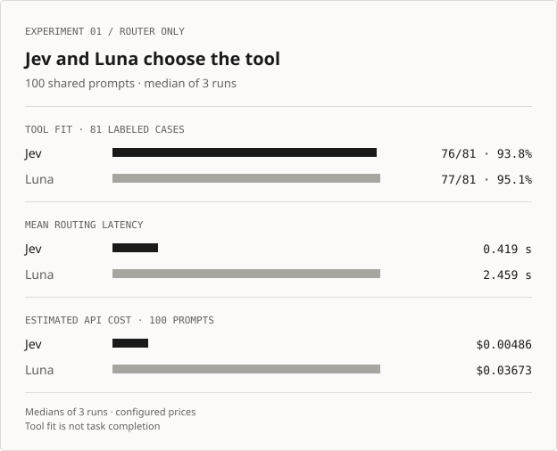
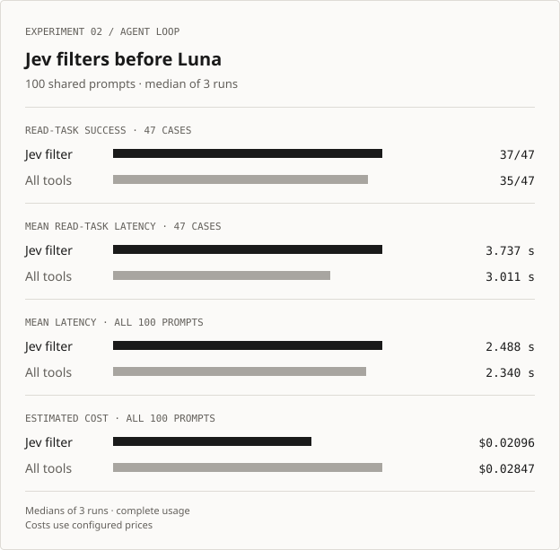

# Can a specialist model choose an agent's tools?

*Two Jev experiments · the same 100 prompts · three paired runs each · September 20, 2026*

I built [Jev Tool Router](../README.md) to ask two questions: **Can Jev choose a suitable tool faster and more cheaply than a general LLM router?** And **does filtering an agent's tools through Jev improve the full task?** Both tests use the [same 100 synthetic prompts](../experiments/shared_cases.json): 47 read tasks, 21 approval cases, 13 ambiguous requests, ten no-tool questions, and nine requests unsupported by the 16-tool catalog. Each test measures a different part of the workflow.

The main results below are medians of **three fresh runs** under the same 3,000 ms Jev routing timeout. Ranges show the smallest and largest run values. All six [published reports](../experiments/published/) have the same dataset hash, 100 cases per arm, and complete token usage. The costs are estimates from configured token prices, not invoices.

## Test 1: Jev makes the routing decision

Jev and an `openai/gpt-5.6-luna` router each made a domain and tool decision for all 100 prompts. No agent call followed. Tool fit is scored on the 81 cases with an acceptable tool label, including cases that should ultimately ask for clarification.

<picture>
  <source media="(max-width: 640px)" srcset="assets/routing-benchmark-100-mobile.svg">
  
</picture>

| Routing metric | Jev median (range) | Luna median (range) |
| --- | ---: | ---: |
| Tool fit, 81 labeled cases | 76/81 (76–76) | 77/81 (76–77) |
| Mean routing latency per run | 419 ms (405–426) | 2,459 ms (2,383–2,539) |
| Estimated cost per 100 prompts | $0.00486 ($0.00484–$0.00486) | $0.03673 ($0.03658–$0.03685) |
| Ready-to-use correct routes | 41 (41–41) | 46 (45–46) |

The [three routing reports](../experiments/published/routing-shared-100-3000ms-run1-2026-09-20.json) ([run 2](../experiments/published/routing-shared-100-3000ms-run2-2026-09-20.json), [run 3](../experiments/published/routing-shared-100-3000ms-run3-2026-09-20.json)) show Jev consistently faster and cheaper for the standalone routing decision. Its tool fit was one case lower in two runs and tied in one. A suitable tool and a ready-to-use route are distinct judgments; Jev returned fewer ready-to-use correct routes.

## Test 2: Jev filters tools before Luna

The flat arm offered Luna all 16 mock tools. The Jev arm called Jev before Luna and offered the selected tool; a routing fallback restored all tools. Both arms saw identical prompts and inert mock results. No external tool ran.

<picture>
  <source media="(max-width: 640px)" srcset="assets/agent-benchmark-100-mobile.svg">
  
</picture>

| Agent metric | Jev filter median (range) | All tools median (range) |
| --- | ---: | ---: |
| Successful outcomes, all 100 | 62 (60–63) | 55 (54–56) |
| Read-task success, 47 cases | 37 (36–37) | 35 (35–38) |
| Mean read-task latency per run | 3.737 s (3.565–4.001) | 3.011 s (2.842–3.204) |
| Mean latency, all 100 | 2.488 s (2.381–2.629) | 2.340 s (2.191–2.481) |
| Estimated cost per 100 prompts | $0.02096 ($0.02081–$0.02114) | $0.02847 ($0.02841–$0.02934) |

All [three agent reports](../experiments/published/agent-bench-shared-100-3000ms-run1-2026-09-20.json) ([run 2](../experiments/published/agent-bench-shared-100-3000ms-run2-2026-09-20.json), [run 3](../experiments/published/agent-bench-shared-100-3000ms-run3-2026-09-20.json)) have complete usage. Jev filtering cost less in every run, by about **26% at the medians**. It was slower in every run on the 47 read tasks and on the overall 100-prompt mean. “Read-task latency” averages all read-task attempts, including failures; it is not a completed-task-only average.

The overall mean blends unlike requests. Jev quickly asked for clarification in **12/13** cases in every run, versus **6–7/13** with all tools. Approval success remained **2–4/21** with Jev and **2–3/21** with all tools; unavailable-tool success was **0–1/9** and **0/9**. These are simple observable checks, not a semantic judge. The median read-task success favors Jev, but the flat arm scored higher in one run (38 versus 37), so the success difference is not consistent across all three.

## What I take from this

For this small catalog, Jev made the standalone routing decision much faster and at lower estimated cost, with similar tool fit. In the practical agent setup, Jev filtering reduced estimated API cost but increased measured task latency. The experiment supports a **cost tradeoff**, not a speed improvement for the full task. The low approval and unsupported-request scores limit any broad reliability claim.

These are synthetic, non-held-out prompts with four tools per domain, inert mock results, and literal answer-fact checks. Three repetitions describe run-to-run variability; they do not establish statistical significance or generalize to production workloads. Neither test measures provider-native tool search or real integrations. A stronger follow-up would use independently labeled held-out tasks, a larger catalog, real or representative tool results, and a supported native tool-search baseline.

The [experiment guide](../experiments/README.md) defines the metrics and rerun commands. Earlier [1.5-second routing](../experiments/published/routing-shared-100-2026-09-20.json) and [agent](../experiments/published/agent-bench-shared-100-run1-2026-09-20.json) ([second run](../experiments/published/agent-bench-shared-100-run2-2026-09-20.json)) reports remain archived. Those agent runs had one timeout with unreported usage each, so their Jev costs were only lower bounds. The still older [86-case routing](../experiments/published/routing-2026-09-20.json) and [ten-task agent](../experiments/published/agent-bench-2026-09-20.json) reports used different datasets. None of those historical results are mixed into the tables above.
