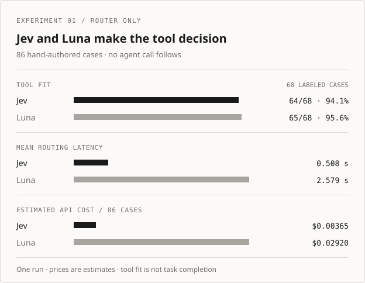
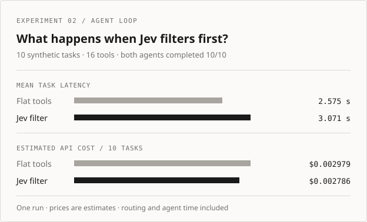

# Can a specialist model choose an agent's tools?

*Two Jev experiments · September 20, 2026*

I built [Jev Tool Router](../README.md) to answer two questions. **Can Jev make the routing decision faster and more cheaply than a general LLM?** And **does adding Jev before an agent's tool call improve the agent?** The first gives Jev the routing job. The second uses the prefilter pattern available through tool APIs today. They are different tests.

## Test 1: Jev makes the routing decision

I gave 86 [hand-authored requests](../experiments/routing_cases.json) to Jev and to an `openai/gpt-5.6-luna` router through OpenRouter. Each chose a domain and tool in two stages. **No agent made a later tool call.**

<picture>
  <source media="(max-width: 640px)" srcset="assets/routing-benchmark-mobile.svg">
  
</picture>

In the [published run](../experiments/published/routing-2026-09-20.json), Jev picked a suitable domain and tool in **64/68** tool-fit cases, versus Luna's **65/68**. Mean routing latency was **508 ms versus 2,579 ms**; estimated total cost was **$0.00365 versus $0.02920**. On all 55 cases labeled ready to route, both picked an acceptable tool. Jev then returned `clarify` on 24 and `fallback` on one, leaving **30/55** ready-to-use routes versus Luna's **35/55**. Choosing the right candidate and deciding to proceed are separate judgments.

So, in this test, Jev performed the **standalone routing job** about five times faster and at roughly one-eighth the estimated cost, with similar tool fit. That is the promising result. It is not a claim that a full agent became faster.

## Test 2: Jev filters tools before Luna

I then tested the pattern an application can use today. In a [paired mock-agent benchmark](../experiments/README.md#agent-task-benchmark), one Luna agent saw all 16 tools. The other received Jev's filtered list before Luna made its own tool-call decision. Both arms saw the same ten synthetic requests and inert tool results; no real service was called.

<picture>
  <source media="(max-width: 640px)" srcset="assets/agent-benchmark-mobile.svg">
  
</picture>

Both arms completed **10/10** tasks. Jev filtering raised mean task latency from **2.575 to 3.071 seconds** while reducing estimated cost from **$0.002979 to $0.002786**. The two-tool task succeeded only when Jev fell back to the full catalog. This small test did **not** show an agent speed benefit from an extra external routing call with 16 tools. See the [run report](../experiments/published/agent-bench-2026-09-20.json).

## What I take from this

The 86-case result suggests that **specialist routing could be valuable closer to a provider's tool-selection path**. In the ten-task test, Luna still made its own tool decision after Jev, so some work was duplicated. An application can already choose or constrain the [tools sent to a model](https://openrouter.ai/docs/guides/features/tool-calling), but this repo cannot replace the provider model's internal automatic selection. OpenAI exposes [native tool search](https://developers.openai.com/api/docs/guides/tools-tool-search); its public docs do not establish whether a Jev-like specialist powers it. Provider adoption remains a hypothesis, not a finding.

The limits matter: these were one-off, synthetic runs with four tools per domain, no real tool execution, and prices configured for estimates rather than taken from invoices. Jev's and Luna's confidence measures are not calibrated against each other. Ten tasks do not establish accuracy parity, and neither run proves statistical significance. The next useful test is a larger catalog with realistic, held-out agent tasks, a multi-tool shortlist, and a comparison against native tool search.

The [experiment guide](../experiments/README.md) has the datasets, reports, configuration, and commands for new runs. The current routing harness differs from the dated run, so it cannot replay that report exactly. The published reports omit complete requests and model answers; the datasets contain the synthetic requests and labels.
